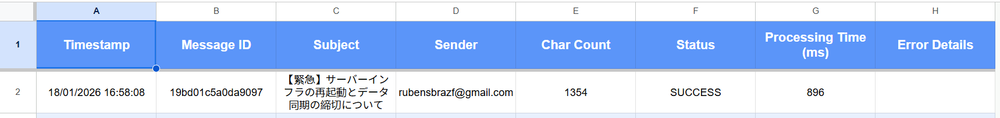
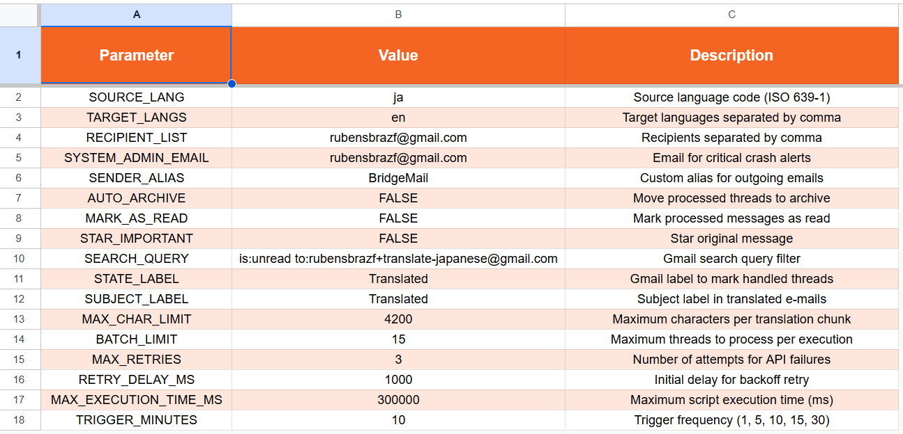
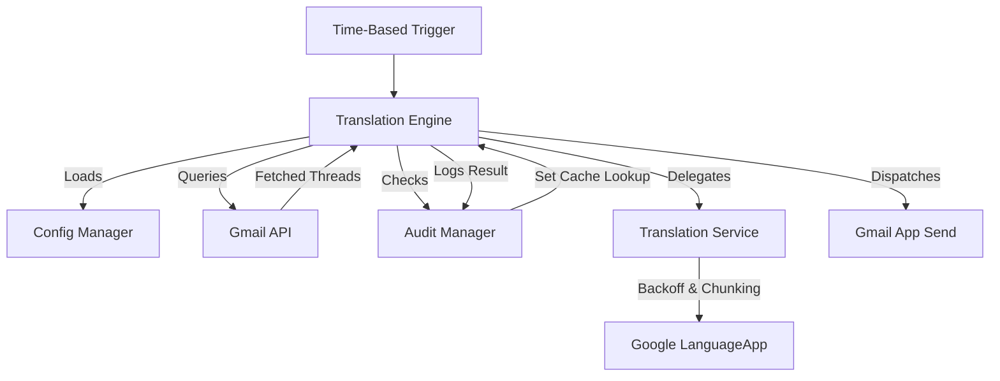

# BridgeMail v1.0 | E-mail Translation Engine


<div align="center">
  <a href="README_pt.md"><strong>Leia em Português</strong></a>
</div>

---

## 📖 Overview

**BridgeMail** is a high-performance email translation engine built for Google Workspace. It automates the monitoring, translation, and re-dispatching of international communications. Unlike simple scripts, BridgeMail follows **Enterprise Design Patterns**, utilizing an optimized $O(1)$ search strategy for audit logs and an intelligent HTML-safe chunking mechanism.

### 🖼️ System Preview

### Audit & Tracking Dashboard


*Log sheet with processing metrics and status tracking.*

### Centralized Configuration


*Dynamic settings sheet.*

### E-mail examples

* 📄 [Original Email (Japanese)](docs/email_examples/Original.pdf): The source payload.

* 📄 [Translated Result](docs/email_examples/Translated.pdf): The final multi-language delivery.

---

## 🌟 Key Features

* **HTML-Safe Chunking:** Slices large email bodies into translatable fragments without breaking HTML tags, ensuring the visual integrity of the original layout.
* **Resilience via Exponential Backoff:** Automatic retry logic with increasing delays ($delay = base \times 2^{n}$) to handle Google Service rate limits.
* **High-Performance Deduplication:** Uses a `Set`-based cache for $O(1)$ lookup complexity, preventing duplicate translations even in massive inboxes.
* **Smart Merge Setup:** One-click infrastructure deployment that preserves existing user data while updating system headers and protections.
* **Multi-Language Orchestration:** Support for multiple target languages in a single execution, generating a unified multi-lingual response.
* **Execution Time Guard:** Self-monitoring system that breaks processing loops before hitting Google's 6-minute script execution limit.

## 🔄 System Architecture



---

## 🛠️ Project Structure

```text
BridgeMail/
├── translator.gs              # Main Engine: Orchestration, Translation & Audit
├── send_test.gs               # Test Tool: Generates a Japanese HTML e-mail
├── docs/
│   ├── images/                # Screenshots of the Sheets interface
│   └── email_examples/        # PDF examples (Original vs Translated)
```

---

## 🚀 Quick Start

### Prerequisites

* A Google account.
* Basic access to Google Sheets.

### Installation & Deployment

1. **Create a Spreadsheet:** Open a new [Google Sheet](https://sheets.new).
2. **Access Apps Script:** Go to `Extensions` > `Apps Script`.
3. **Paste the Code:** Copy the contents of `translator.gs` and `send_test.gs` into the editor.
4. **Initialize:** Refresh the Spreadsheet.
    * Go to the **BridgeMail** menu > **Setup System**.
5. **Settings:** Update the `Settings` sheet.

---

## 🔐 Security & Permissions

When you run BridgeMail for the first time, Google will request permissions to access your Gmail, Sheets, and Translation services.

> **Note:** You might see a "Google hasn't verified this app" screen. This is normal for private scripts. Click **Advanced** > **Go to BridgeMail (unsafe)** to proceed. The script runs entirely within your account; no data is shared with third parties except for the Google Translation API.

---

## 🔍 Troubleshooting

| Issue | Potential Cause | Solution |
| :--- | :--- | :--- |
| **Script Timeout** | `BATCH_LIMIT` is too high or emails are too large. | Lower `BATCH_LIMIT` or `MAX_CHAR_LIMIT`. |
| **Quota Exceeded** | Daily translation limit reached. | Google limits free tier translations. Wait 24h. |
| **No Emails Found** | `SEARCH_QUERY` is too restrictive. | Test your query directly in the Gmail search bar. |
| **Wrong Layout** | HTML tags in source are malformed. | BridgeMail attempts to fix this, but check the source. |

---

## ⚖️ License (CC BY-NC 4.0)

This project is licensed under the **Creative Commons Attribution-NonCommercial 4.0 International License**.

[](http://creativecommons.org/licenses/by-nc/4.0/)

### Summary of Terms

* **Attribution:** You must give appropriate credit to the author.
* **NonCommercial:** You may **NOT** use the material for commercial purposes.
* **Adaptation:** You can remix and build upon the material.

---

## 👨‍💻 Author

Rubens Braz
