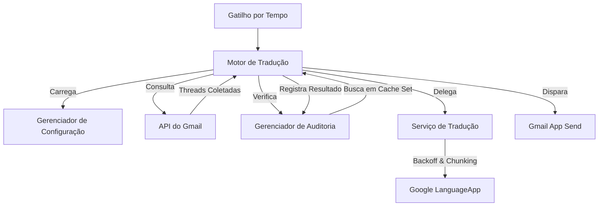

# BridgeMail v1.0 | E-mail Translation Engine


<div align="center">
  <a href="README.md"><strong>Read in English</strong></a>
</div>

---

## 📖 Visão Geral

O **BridgeMail** é um motor de tradução de e-mails de alta performance desenvolvido para o Google Workspace. Ele automatiza o monitoramento, a tradução e o reenvio de comunicações internacionais. Diferente de scripts simples, o BridgeMail segue **Padrões de Design Corporativos**, utilizando uma estratégia de busca $O(1)$ otimizada para logs de auditoria e um mecanismo inteligente de fragmentação (chunking) seguro para HTML.

### 🖼️ Pré-visualização do Sistema

### Painel de Auditoria e Rastreamento


*Página de log com métricas de processamento e rastreamento de status.*

### Configuração Centralizada


*Página de configurações dinâmicas.*

### Exemplos de E-mail

* 📄 [E-mail Original (Japonês)](docs/email_examples/Original.pdf): O payload de origem.
* 📄 [Resultado Traduzido](docs/email_examples/Translated.pdf): A entrega final multilíngue.

---

## 🌟 Principais Recursos

* **Fragmentação Segura de HTML (HTML-Safe Chunking):** Divide corpos de e-mail extensos em fragmentos traduzíveis sem quebrar tags HTML, garantindo a integridade visual do layout original.
* **Resiliência via Exponential Backoff:** Lógica de repetição automática com atrasos crescentes ($delay = base \times 2^{n}$) para lidar com limites de taxa (rate limits) dos serviços do Google.
* **Deduplicação de Alta Performance:** Utiliza um cache baseado em `Set` para complexidade de busca $O(1)$, evitando traduções duplicadas mesmo em caixas de entrada volumosas.
* **Configuração de Mesclagem Inteligente (Smart Merge):** Implantação de infraestrutura com um clique que preserva dados existentes do usuário enquanto atualiza cabeçalhos e proteções do sistema.
* **Orquestração Multilíngue:** Suporte para múltiplos idiomas de destino em uma única execução, gerando uma resposta multilíngue unificada.
* **Guarda de Tempo de Execução:** Sistema de automonitoramento que interrompe loops de processamento antes de atingir o limite de 6 minutos de execução de script do Google.

## 🔄 Arquitetura do Sistema



---

## 🛠️ Estrutura do Projeto

```text
BridgeMail/
├── translator.gs       # Motor Principal: Orquestração, Tradução e Auditoria
├── send_test.gs        # Ferramenta de Teste: Gera um e-mail HTML em japonês
├── docs/
│   ├── images/         # Capturas de tela da interface do Sheets
│   └── email_examples/ # Exemplos em PDF (Original vs Traduzido)
```

---

## 🚀 Início Rápido

### Pré-requisitos

* Uma conta Google.

### Instalação e Implantação

Você pode configurar o **BridgeMail** de duas formas. O método recomendado economiza tempo e garante que todas as formatações, validações de dados e proteções de células sejam aplicadas corretamente.

#### Opção A: Usando o Template Oficial (Recomendado)

1. **Acesse o Template:** Abra a [Planilha Mestra do BridgeMail](https://docs.google.com/spreadsheets/d/12k8AAtDM4alEI6LFXGW6boerH_lT5J9APZVl6DvWZL4/edit?usp=sharing).
2. **Duplique o Arquivo:** Vá em `Arquivo` > `Fazer uma cópia`. Isso criará uma instância privada do motor na sua conta.
3. **Configure os Parâmetros:** Acesse a aba `Settings` e preencha os valores necessários (e-mails, códigos de idioma, etc.).
4. **Instale a Automação:** No menu superior, clique em **BridgeMail** > **Refresh Trigger Automation**. Isso ativará o monitoramento em segundo plano.

#### Opção B: Configuração Manual

1. **Criar Planilha:** Abra uma nova [Planilha Google](https://sheets.new).
2. **Acessar Apps Script:** Vá em `Extensões` > `Apps Script`.
3. **Colar o Código:** Crie os arquivos `translator.gs` e `send_test.gs` e cole seus respectivos conteúdos.
4. **Inicializar Sistema:** Atualize a página da planilha e acesse o menu **BridgeMail** > **Setup System**.
5. **Configurações:** Preencha a aba `Settings` gerada automaticamente pelo processo de setup.
6. **Ativar Trigger:** Vá ao menu **BridgeMail** > **Refresh Trigger Automation**.

---

## 🔐 Segurança e Permissões

Ao executar o BridgeMail pela primeira vez, o Google solicitará permissões para acessar seu Gmail, Sheets e os serviços de Tradução.

> **Nota:** Você pode ver uma tela de "O Google não verificou este app". Isso é normal para scripts privados. Clique em **Avançado** > **Acessar BridgeMail (não seguro)** para prosseguir. O script roda inteiramente na sua conta; nenhum dado é compartilhado com terceiros, exceto com a API de Tradução do Google.

---

## 🔍 Solução de Problemas

| Problema | Causa Potencial | Solução |
| :--- | :--- | :--- |
| **Script Timeout** | `BATCH_LIMIT` muito alto ou e-mails muito grandes. | Reduza o `BATCH_LIMIT` ou `MAX_CHAR_LIMIT`. |
| **Cota Excedida** | Limite diário de tradução atingido. | O Google limita traduções na conta gratuita. Aguarde 24h. |
| **E-mails não encontrados** | `SEARCH_QUERY` é muito restritivo. | Teste sua busca diretamente na barra de pesquisa do Gmail. |
| **Layout Quebrado** | Tags HTML na origem estão malformadas. | O BridgeMail tenta corrigir, mas verifique o código-fonte. |

---

## ⚖️ Licença (CC BY-NC 4.0)

Este projeto está licenciado sob a **Creative Commons Attribution-NonCommercial 4.0 International License**.

[](http://creativecommons.org/licenses/by-nc/4.0/)

### Resumo dos Termos

* **Atribuição:** Você deve dar o crédito apropriado ao autor.
* **Não Comercial:** Você **NÃO** pode usar o material para fins comerciais.
* **Adaptação:** Você pode remixar e adaptar o material.

---

## 👨‍💻 Autor

Rubens Braz
